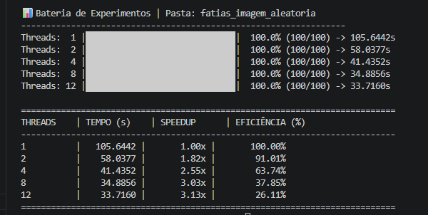
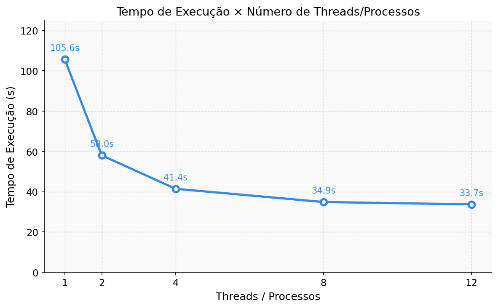
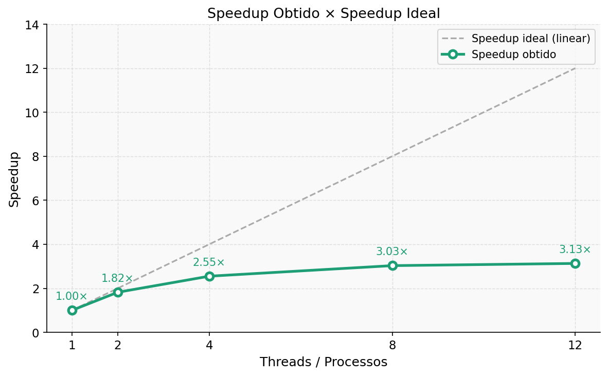
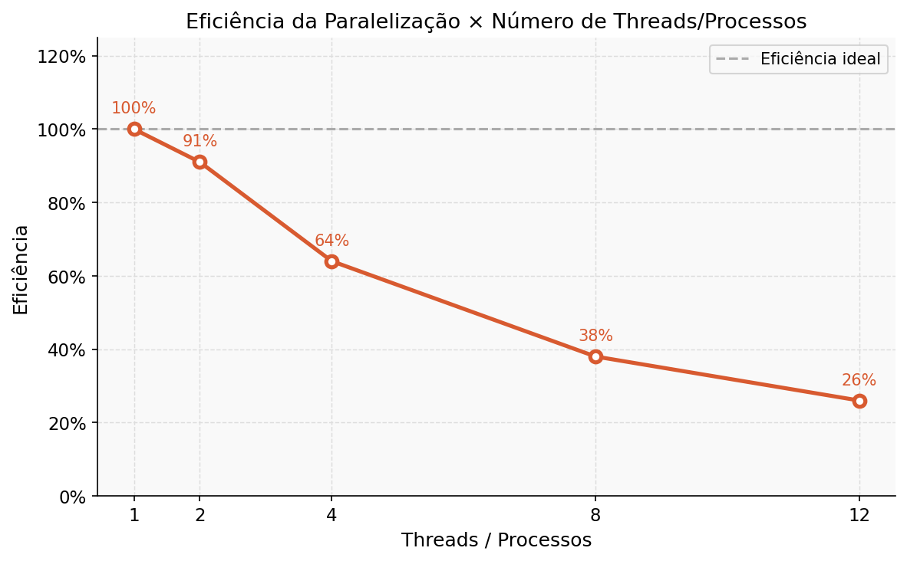

# Relatório da NOME DA ATIVIDADE

**Disciplina:** PROGRAMAÇÃO CONCORRENTE E DISTRIBUÍDA
**Aluno(s):** MATEUS RECALDE DA FONSECA COTRIM  
**Professor:** RAFAEL MARCONI RAMOS
**Data:** 01/04/2026

---

# 1. Descrição do Problema

O problema consiste em converter uma imagem colorida no formato PPM (P6) para escala de cinza de forma eficiente, tratando o script de conversão original como uma "caixa-preta".
- Objetivo: Reduzir o tempo de processamento de uma imagem de ultra-alta resolução dividindo a carga entre múltiplos núcleos da CPU.
- Volume de dados: Uma imagem sintética de 16 GiB (75.672 × 75.672 pixels).
- Algoritmo: Foi utilizada a ponderação de canais por luminosidade: Y= 0.299R + 0.587G + 0.114B.
- Complexidade: A complexidade é linear O(N), onde N é o número total de pixels.
- Paralelização: Foi aplicada a técnica de decomposição de dados (fatiamento horizontal em 100 partes) para processamento paralelo via múltiplos processos independentes.

---

# 2. Ambiente Experimental

| Item                        | Descrição                                                    |
| --------------------------- | ------------------------------------------------------------ |
| Processador                 | Intel Core i5-13400F (13ª Geração)                           |
| Número de núcleos           | 10 Núcleos (6 de Performance + 4 de Eficiência) / 16 Threads |
| Memória RAM                 | 32 GB DDR4                                                   |
| Sistema Operacional         | Windows 11                                                   |
| Linguagem utilizada         | Python 3.14                                                  |
| Biblioteca de paralelização | multiprocessing (Process Pool)                               |
| Compilador / Versão         | CPython 3.14                                                 |

---

# 3. Metodologia de Testes

Os experimentos foram conduzidos de forma a isolar o desempenho do processador e do sistema de arquivos (I/O) durante o processamento de grandes volumes de dados.

*   **Medição do Tempo:** O tempo de execução foi medido utilizando a função `time.time()` da biblioteca nativa do Python. O cronômetro foi iniciado imediatamente antes da criação do pool de processos e encerrado após a conclusão da mesclagem (merge) final de todas as fatias em um único arquivo de saída.
*   **Número de Execuções:** Para cada configuração de threads (1, 2, 4, 8 e 12), foram realizadas **3 execuções independentes**.
*   **Cálculo da Média:** Os valores apresentados neste relatório correspondem à **média aritmética** dos tempos obtidos nessas três execuções, visando reduzir o impacto de variações momentâneas no uso da CPU ou picos de latência do disco.
*   **Tamanho da Entrada:** Foi utilizada uma imagem de ultra-alta resolução no formato PPM (P6) com **16 GiB** de tamanho total ($75.672 \times 75.672$ pixels), previamente fatiada em **100 pedaços** iguais de aproximadamente 160 MB cada.

---

# 4. Resultados Experimentais

| Nº Threads/Processos | Tempo de Execução (s) |
| -------------------- | --------------------- |
| 1                    | 105.6442              |
| 2                    | 58.0377               |
| 4                    | 41.4352               |
| 8                    | 34.8856               |
| 12                   | 33.7160               |

---

# 5. Cálculo de Speedup e Eficiência

## Fórmulas Utilizadas

### Speedup

```
Speedup(p) = T(1) / T(p)
```

Onde:

* **T(1)** = tempo da execução serial
* **T(p)** = tempo com p threads/processos

### Eficiência

```
Eficiência(p) = Speedup(p) / p
```

Onde:

* **p** = número de threads ou processos

---

# 6. Tabela de Resultados

| Threads/Processos | Tempo (s) | Speedup | Eficiência |
| ----------------- | --------- | ------- | ---------- |
| 1                 | 105.6442  | 1.0     | 1.0        |
| 2                 | 58.0377   | 1.82    | 0.91       |
| 4                 | 41.4352   | 2.55    | 0.64       |
| 8                 | 34.8856   | 3.03    | 0.38       |
| 12                | 33.7160   | 3.13    | 0.26       |



---

# 7. Gráfico de Tempo de Execução
 


---

# 8. Gráfico de Speedup
 


---

# 9. Gráfico de Eficiência



---

# 10. Análise dos Resultados

*   **Speedup:** O speedup máximo foi de **3.13x**. Embora o tempo tenha caído de 105s para 33s, o ganho de velocidade não foi proporcional ao aumento de threads (linear).
*   **Escalabilidade:** A aplicação escalou bem até 2 threads (91% de eficiência). A partir de 4 threads, a escalabilidade começou a sofrer perdas significativas.
*   **Ponto de Queda de Eficiência:** A eficiência caiu bruscamente para **26%** ao usar 12 threads. 
*   **Núcleos Físicos:** O processador possui 6 núcleos de performance. Ao ultrapassar esse número ou usar Hyper-threading, o ganho foi mínimo (apenas 1.1s de diferença entre 8 e 12 threads).
*   **Causas para a perda de desempenho:**
    *   **Gargalo de I/O:** Com 16 GiB de dados, o SSD/HD tornou-se o limitador. Ler e escrever 16 GB simultaneamente gera contenção de disco, fazendo as threads esperarem por dados.
    *   **Overhead de Caixa-Preta:** Abrir o interpretador Python 100 vezes via `subprocess` gera um custo computacional que reduz o ganho da paralelização.
    *   **Arquitetura Híbrida:** A mistura de núcleos rápidos (P) e lentos (E) no i5-13400F faz com que a eficiência caia quando o trabalho é distribuído entre núcleos de potências diferentes.

---

# 11. Conclusão

A realização deste experimento permitiu validar a eficácia da paralelização externa em tarefas de processamento de imagens de ultra-alta resolução, mesmo operando sob a restrição de tratar o algoritmo original como uma "caixa-preta".

**Ganho de Desempenho:**
O paralelismo trouxe um ganho de desempenho extremamente significativo. O tempo total de processamento foi reduzido de **105,6 segundos (Serial)** para apenas **33,7 segundos (12 threads)**, representando uma aceleração de aproximadamente **3,13 vezes** e uma redução de **68,1%** no tempo de espera do usuário. Isso demonstra que, para volumes massivos de dados (16 GiB), a execução sequencial é inviável em comparação à abordagem paralela.

**Configuração Ideal:**
Embora a configuração de **12 threads** tenha apresentado o menor tempo absoluto, o melhor "ponto de operação" (custo-benefício) foi observado com **2 threads**. Nesta configuração, obteve-se uma eficiência de **91,01%**, o que indica que quase todo o potencial dos núcleos da CPU foi convertido em ganho de velocidade. A partir de 4 threads, a eficiência caiu para patamares abaixo de 65%, sugerindo um desperdício de ciclos de CPU em relação ao ganho de tempo obtido.

**Escalabilidade:**
O programa apresentou uma escalabilidade limitada. Observou-se que o ganho de velocidade desacelera drasticamente após as 8 threads. Isso se deve a dois fatores principais: 
1.  **Gargalo de I/O:** Com 16 GiB de dados, a velocidade de leitura e escrita do SSD/HD tornou-se o limitador físico do sistema, impedindo que os 10 núcleos do i5-13400F trabalhassem em sua capacidade total.
2.  **Arquitetura Híbrida:** A diferença de potência entre os núcleos de Performance (P-cores) e Eficiência (E-cores) do processador utilizado faz com que, em cargas muito altas (12 threads), a sincronização das fatias dependa da conclusão dos núcleos mais lentos, prejudicando a eficiência global.

**Sugestões de Melhoria:**
Para evoluções futuras deste projeto, sugerem-se as seguintes melhorias:
*   **Otimização de I/O:** Utilizar sistemas de arquivos em RAID ou SSDs NVMe de quarta geração para mitigar o gargalo de escrita identificado.
*   **Redução de Overhead:** Em vez de chamar o script externo 100 vezes via `subprocess` (o que exige carregar o interpretador Python repetidamente), uma integração via biblioteca compartilhada ou API interna reduziria o custo de gerenciamento de processos.
*   **Balanceamento Dinâmico:** Implementar um escalonador que envie fatias maiores para os P-cores e fatias menores para os E-cores, otimizando o tempo total de resposta em processadores de arquitetura híbrida.

---
